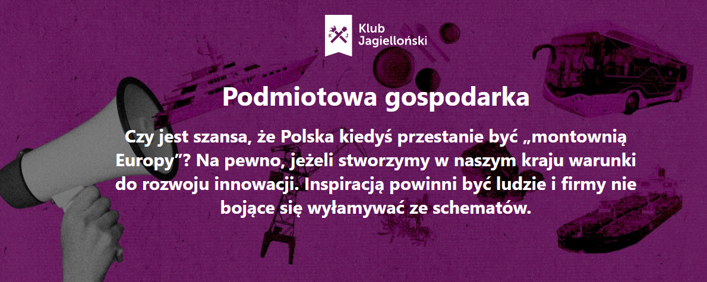

W dniu 24 czerwca odbyła się gala z okazji 10-lecia działalności Związku Przedsiębiorców i Pracodawców. Uczestniczyło w niej około 250 przedstawicieli życia gospodarczego, politycznego i świata mediów.

Nagrodę ZPP w kategorii: „Instytucja przyjazna przedsiębiorcom”, z rąk Marcina Piskorskiego, Prezesa zarządu ZPA PharmaNET odebrał Piotr Trudnowski, Prezes Klubu Jagiellońskiego. Stowarzyszenie propaguje ideę „podmiotowości gospodarczej Polski” po to, aby Polska była czymś znacznie ważniejszym, niż bycie jedynie „montownią Europy”. Publikacje Klubu Jagiellońskiego cechują się wyważonym charakterem, w ramach którego przedsiębiorczość jest wartością godną uwag i pielęgnowania.

## Czytaj więcej w dziale Podmiotowa Gospodarka na portalu Klubu Jagiellońskiego, [wydawcy aplikacji Pola](https://klubjagiellonski.pl/2016/11/19/kod-kreskowy-nie-definiuje-polskosci/)

