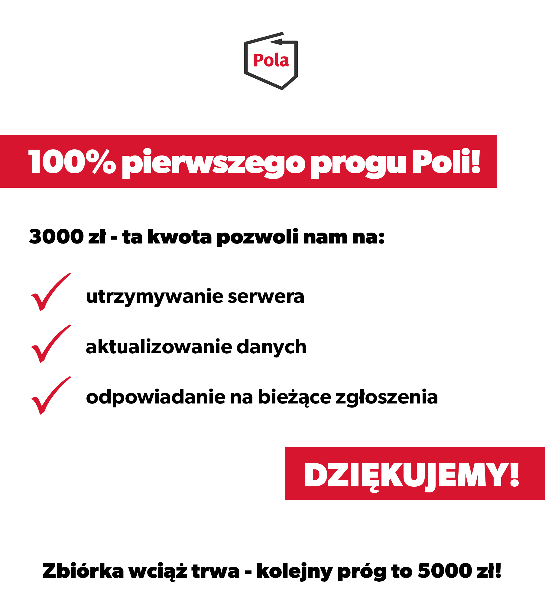

Dzięki waszemu wsparciu możemy się dalej rozwijać!

Nasza aplikacja jest całkowicie darmowa, a większość prac wykonywana jest wolontaryjnie. Staramy się wspierać patriotyzm gospodarczy i zachęcać do świadomej konsumocji. Nie było by to możliwe bez waszego wsparcia. Dzięki temu możemy planować kolejne działania!

Na co zostaną przeznaczone te pieniądze? Opisaliśmy szczegółowo cele na [stronie naszej zbiórki](https://klubjagiellonski.pl/zbiorka/wspieraj-aplikacje-pola/).

Przekroczenie pierwszego progu pozwala nam opłacić koszty stałe, takie jak serwer, odpowiadać na bieżące zgłoszenia, oraz pracować nad rowojem bazy firm i produktów.