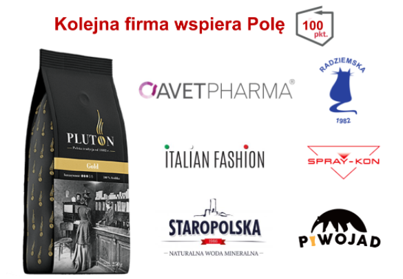

Przygotowaliśmy program wsparcia dla przedsiębiorców, dzięki któremu ocena firmy może być widoczna bezpośrednio na opakowaniu produktów.

### [Zobacz wszystkich Przyjaciół Poli](https://klubjagiellonski.github.io/pola-web/friends)

Nasz znak towarowy jest przeznaczony tylko i wyłącznie dla firm, które otrzymują 100 pkt. w naszej aplikacji. To oznaczenie wyróżnia się znacząco wśród innych biało-czerwonych logotypów, z których do woli mogą kożystać zagraniczne koncerny.

Historia tej firmy sięga XIX wieku. Jej założycielem był Tadeusz Tarasiewicz, który założył pierwszą na ziemiach polskich palarnię kawy, pod nazywą Pluton. Firma przetrwała do 1950 r. W 2017 r. została reaktywowana. Pluton Kawa kultywuje tradycje i z powodzeniem stosuje współcześnie wartości kupieckie XX-lecia międzywojennego.

## [Odwiedź stronę Pluton Kawa](https://sklep.kawapluton.com/)

Więcej o naszym znaku towarowym [znajdziesz tu](https://klubjagiellonski.github.io/pola-web/friends).

Kontakt: Mateusz Perowicz, mail - mateusz.perowicz@klubjagiellonski.pl, tel. 660 010 034