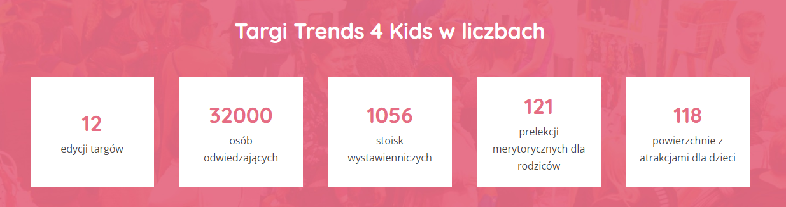

Aplikacja Pola po raz kolejny została partnerem targów [Trends 4 Kids](https://trends4kids.pl/)

„Trends 4 Kids to targi dedykowane rodzicom oczekującym dziecka i rodzicom z dziećmi w wieku 0-9 lat, którzy poszukują oryginalnych, wyjątkowych produktów, innych niż te które na co dzień spotykamy w sieciówkach, cenią jakość, nowoczesny dizajn, a także ręczne wykonania od producentów handmade”.

Inicjatywa prowadzona jest od kilku lat, a od dwóch edycji jej partnerem jest aplikacja Pola. Zabierz ją na zakupy. To wydarzenia łączy w sobie promowanie małych i lokalnych przedsiębiorstw z edukacją na temat znaczenia patriotyzmu gospodarczego. Jak możemy przeczytać na stronie:

„w jednym miejscu skupiamy polskich twórców i designerów, którzy stawiają na odpowiedni dobór materiałów i przemyślane rozwiązania, staranne i trwałe wykonanie, dbając o bezpieczeństwo, zdrowie i komfort codziennego życia Twojej rodziny”.