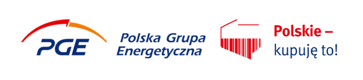
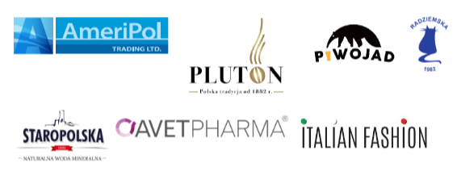

Klub Jagielloński, wydawca aplikacji Pola. Zabierz ją na zakupy promującej, patriotyzm gospodarczy, z okazji obchodów szóstych urodzin Aplikacji Pola, publikuje raport: „Liderzy świadomej konsumpcji. Najczęściej skanowane firmy aplikacji Pola”. 

Klub Jagielloński od sześciu lat stara się przekonywać, jak ważna jest świadoma konsumpcja. Każdy pojedynczy zakup, dokonywany przy sklepowej półce odgrywa bardzo ważną rolę. Dlatego prowadzone przez Stowarzyszenie działania mają na celu zwiększenie świadomości konsumenckiej i dostarczanie narzędzi niezbędnych do podjęcia świadomego wyboru. Klub Jagielloński za pomocą aplikacji Pola, stara się również przekonywać, że warto wspierać polskie firmy.

Z okazji urodzin aplikacji Pola opublikowany zostanie ranking najczęściej skanowanych firm w historii aplikacji. Łączna liczba zeskanowanych produktów przekroczyła już 10 milionów. Przygotowane zestawienie jest więc odzwierciedleniem wielu decyzji konsumenckich i preferencji zakupowych Polaków.

Pełny ranking pod tytułem „Liderzy świadomej konsumpcji. Najczęściej skanowane firmy aplikacji Pola” zostanie zaprezentowany 18 listopada. Ważnym elementem promocji rankingu będzie [debata transmitowana on-line](https://www.facebook.com/events/601572124422768?acontext=%7B%22event_action_history%22%3A[%7B%22surface%22%3A%22page%22%7D]%7D), poświęcona zjawisku patriotyzmu gospodarczego i idei świadomej konsumpcji, na której gościć będą przedstawiciele instytucji publicznych i biznesu. Transmisja z debaty rozpocznie się o godzinie 17:00.

W debacie wezmą udział:
- Adam Abramowicz, Rzecznik Małych i Średnich Przedsiębiorców, były prezes zarządu Sieci Detalistów „Nasze Sklepy”, wcześniej samorządowiec i poseł
- Tomasz Budziak, wiceprezes zarządu stowarzyszenia Inicjatywa Firm Rodzinnych, autor raportu „Jaką przyszłość ma polski biznes rodzinny? Wpływ zmian pokoleniowych i demograficznych na biznes rodzinny”.
- Bartłomiej Dzik, Zastępca Dyrektora w Urząd Ochrony Konkurencji i Konsumentów, obecnie kieruje Departamentem Analiz Konsumenckich
Moderacja: Adam Zych, członek Rady Klubu Jagiellońskiego, założyciel i prezes fundacji Projekt PL

Ranking powstał w ramach współpracy z partnerem aplikacji Pola, Grupą PGE, która zainicjowała [kampanię, społeczną Polskie kupuję to!](https://polskiekupujeto.pl/). Pełna wersja rankingu będzie dostępna online w dniu wydarzenia na stronie Klubu Jagiellońskiego.

Debata jest częśią obchodów szóstych urodzin aplikacji Pola, które są dedykowane [członkom Klubu Przyjaciół Poli](https://www.pola-app.pl/friends).

