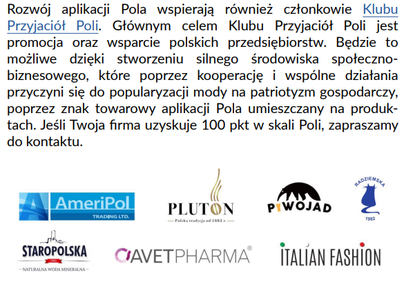

 
Łączna liczba skanowań dokonywana za pomocą aplikacji przekroczyła 10 milionów. Przedstawiony ranking jest więc odzwierciedleniem wielu świadomych decyzji konsumenckich.
 
W zestawieniu znalazło się 37 przedsiębiorstw, które otrzymują maksymalną liczbę punktów w algorytmie aplikacji Pola, w tym cztery w pierwszej piątce.
 
Niekwestionowanym liderem okazała się Grupa Maspex. W rankingu znalazło się aż sześć spółek należących do tej grupy, które zeskanowano łącznie 465 090 razy.
 

 
Ranking jest dostępny na stronie Klubu Jagiellońskiego, wydawcy aplikacji Pola. [stronie naszej zbiórki](https://klubjagiellonski.pl/publikacje/liderzy-swiadomej-konsumpcji-najczesciej-skanowane-firmy-aplikacji-pola/).
 
W pierwszej 10. znalazły się firmy: Nestle Polska S.A., Spółdzielnia Mleczarska Mlekovita, Unilever Polska Sp. z o.o., Spółdzielnia Mleczarska Mlekpol w Grajewie, Agros-Nova S.A., Lidl Polska, Coca-Cola HBC Polska Grupa, Żywiec S.A., Tymbark - MWS Sp. z o.o. Sp. k., Kompania Piwowarska S.A..
