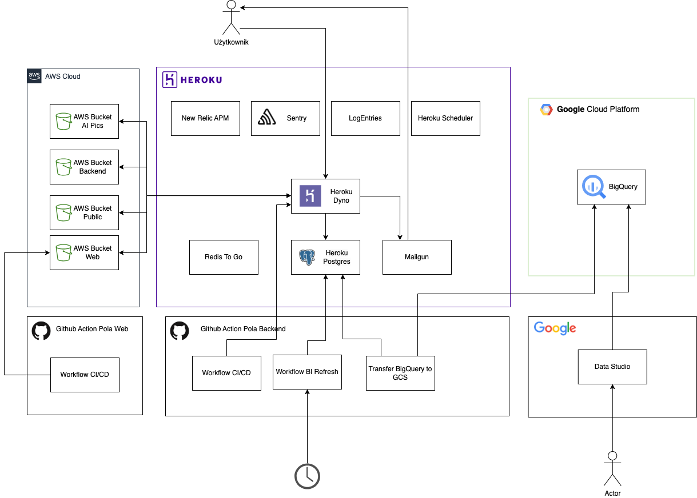

.. contents:: :local:

Omówienie
=========

Projekt Pola składa się z kilku podprojektów, którego rdzeniem jest proejkt ``pola-backend`` i na nim się skupimy w tym dokumencie

.. image:: ./introduction.png

* `pola-backend <https://github.com/KlubJagiellonski/pola-backend>`__ - rdzeń aplikacji napisany w Django.
* `pola-ios <https://github.com/KlubJagiellonski/pola-ios>`__  - aplikacja na system iOS.
* `pola-android <https://github.com/KlubJagiellonski/pola-android>`__ - aplikacja na system Android.
* `pola-flutter <https://github.com/KlubJagiellonski/pola-flutter>`__ - aplikacja multiplatformowa napisana w Flutter (projekt niewydany).
* `pola-web <https://github.com/KlubJagiellonski/pola-web>`__ - statyczna strona napisana w Gatsby.
* `pola-bi <https://github.com/KlubJagiellonski/pola-backend/tree/master/pola-bi/>`__ - zbiór narzędzi odpowiedzialnych za analityke biznesową (projekt niewydany).

* `pola-ai <https://github.com/KlubJagiellonski/pola-ai>`__ - sztuczna inteligencja rozpoznajaca produkty (projekt porzucony).
* `pola-facebook <https://github.com/KlubJagiellonski/pola-facebook>`__ - chatbot na Facebook (projekt porzuczony).

Architektura
------------

Założenia
---------

* ``pola-backend`` zapewnia dwie funkcjonalności:

  * API wykorzystywany przez ``pola-ios``, ``pola-android``, ``pola-flutter``, ``pola-web``
  * CMS wykorzystywany przez redakcje do aktualizacji danych

* ``pola-backend`` jest uruchamiana na platformie ``Heroku``
  Platforma dostarcza kilka usług oodpowiedzialnych za monitoring:

  * `New Relic APM <https://elements.heroku.com/addons/newrelic>`__ - monitoring aplikacji (rzadko wykorzystywany)
  * `Logentries <https://elements.heroku.com/addons/logentries>`__ - dziennik aplikacji
  * `Sentry <https://elements.heroku.com/addons/sentry>`__ - monitoring błedów w aplikacji (często wykorzystywany)
  * `Heroku Scheduler <https://elements.heroku.com/addons/scheduler>`__ - uruchamianie operacji cyklicznych

  Ponad to dostarcza usługi składowania danych:

  * `Redis To Go <https://elements.heroku.com/addons/redistogo>`__ - cache
  * `Heroku Postgres <https://elements.heroku.com/addons/heroku-postgresql>`__ - baza danych\

  Wykorzystywany jest również `MailGun <https://elements.heroku.com/addons/mailgun>`__ do wysyłania wiadomości z przypomniemiem hasła.

* ``pola-backend`` jest aplikacja kontenerową wdrażana przez process Ci/CD uruchamiany na Github Action. Po szczegóły, patrz: `Wdrożenie <./deploy.rst>`__

* ``pola-web`` jest rozwijana, jako niezależna aplikacja Gatsby/React, a następnie w procesie CI/CD uruchamianym na ``Github Action`` jest publikowana na wiaderku ``AWS Bucket Web``. ``pola-web`` odczytuje dane z wiaderka i zwraca użytkowniką. Z tego wynika, że ``pola-backend`` i ``pola-web`` mogą być wdrażane niezależnie, ale wykorzystują wspólne wiaderko.

* ``pola-backend`` wykorzystuje wiaderka na platformie AWS:

  * ``AWS Bucket AI Pics`` - przechowuje zdjęcia od użytkowników, które miały być wykorzystywane przez ``pola-ai`` (project porzucony).
  * ``AWS Bucket Backend`` - przechowuje pliki przesłane przez uzytkowników, które nie powinny być publiczne np. raporty.
  * ``AWS Bucket Public`` - przechowuje pliki statyczne np. kod CSS/JS,. Zawartość jest publiczna dla wszystkich.
  * ``AWS Bucket Web`` - przechowuje skompilowana aplikacje ``pola-web``.

* ``pola-bi`` jest zbiorem narzędiz, który uruchamia się cyklicznie na Github Action, który transformuje dane w ``Heroku Postgres``, a następnie zapisuje je w ``Google BigQuery``, co pozwala na dostęp do danych przez raporty utworzone w ``Google Datastudio``. Nie jest możliwe wykorzysywane bezpośredniego połączenia z ``Google Datastudio`` do ``Heroku Postgress``, ponieważ ``Heroku Postgress`` regularnie zmienia hasła, a ``Google Datastudio`` nie umożliwia API do aktualizacji danych
