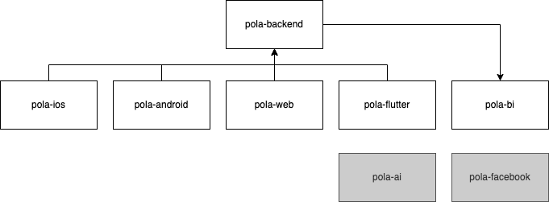

.. contents:: :local:

Omówienie
=========

Projekt Pola składa się z kilku podprojektów, którego rdzeniem jest proejkt ``pola-backend``.

* `pola-backend <https://github.com/KlubJagiellonski/pola-backend>`__
* `pola-ios <https://github.com/KlubJagiellonski/pola-ios>`__
* `pola-android <https://github.com/KlubJagiellonski/pola-android>`__
* `pola-flutter <https://github.com/KlubJagiellonski/pola-flutter>`__
* `pola-facebook <https://github.com/KlubJagiellonski/pola-facebook>`__
* `pola-web <https://github.com/KlubJagiellonski/pola-facebook>`__

Architektura aplikacji
----------------------

.. image:: ./architecture.png
